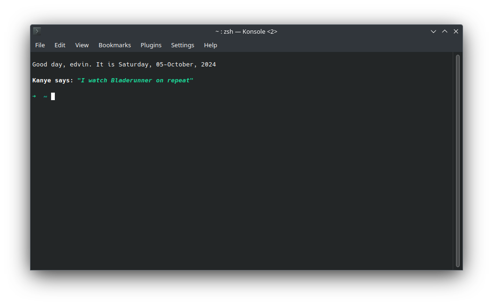

 
## oh-my-kanye - Display the wisdom of Kanye in your terminal

### What is this?
- This is a small startup plugin for `zsh`. It displays a greeting for the user, and a random quote from Kanye to help you be more productive;
- For fetching quotes, the [Kanye Rest API](https://kanye.rest/) is used. You will need either `curl` or `wget` in order to tune in to Kanye's wisdom.

### How to install
To install the plugin and be amongst those blessed by Kanye's prowess, follow these steps:
1. Clone this repository into your `zsh` plugins folder (usually `~/.oh-my-zsh/plugins`). If you are really adamant about saving memory, you can delete everything from the cloned repository except for the `oh-my-kanye.plugin.zsh` file;
2. Activate the plugin in your `.zshrc` file (usually located in `~`) by adding it to your plugins list: `plugins=(... oh-my-kanye)`;
3. Enjoy ever-lasting wisdom every time you start up a terminal session.

### But seriously, why?
- I wanted to try making a zsh plugin - turns out it is really easy. And what better theme for a plugin than this?